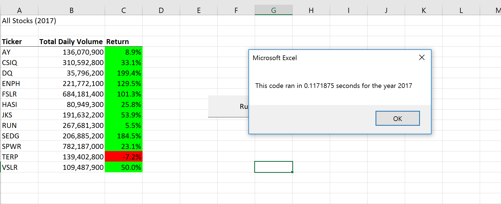
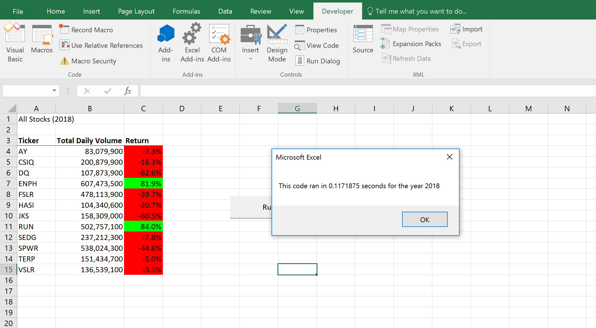

# VBA_StockAnalysis_Challenge

## Overview of Project

### Purpose
The purpose of this assignment was to refactor code so Steve could analyze the entire stock market over the past few years. Previously the code was written to execute the 12 stocks we were analyzing before. We wanted to make the code execute faster as well as let Steve analyze more stocks. Using this code, Steve can analyze  the total daily volume as well as the return of the stock by year to determine where to invest in.
## Results
Looking at 2017 vs 2018 results, 2017 was overall was a much more successful year regarding the 12 stocks Steve was analyzing. In 2017 only 1 of the stocks listed (TERP) had a negative return.   In 2018, all but 2 stocks had a negative return. Most of these stocks with a negative return had over a negative 20% return. Two stocks did perform well in 2018 (ENPH and RUN) with over a positive 80% return. Overall with the stocks Steve was looking at, 2017 was the better year to invest in. Some 2017 stocks were over 100% return! 

**2017 Results w/Refactored Time Speed**

**2018 Results w/Refactored Time Speed**

Refactoring the code did lead to a faster execution speed. Before the code was refactored speeds were .50 for (2017) and .69 for (2018). After refactoring the code, speed times were .11 seconds for both 2017 and 2018.  
 
## Summary
- What are the advantages or disadvantages of refactoring code?

 I found one of the advantages of refactoring the code was being able to use bits and pieces of code used previously and altering them to make them more efficient.  One of the disadvantages I found in refactoring code was the frustration of trying to make new code work with the old code. Sometimes during the challenge I felt it would have been easier to completely start from scratch rather than try to refactor the old code to make it work.
 
- How do these pros and cons apply to refactoring the original VBA script?

 While refactoring the original VBA script, I was able to reuse and edit existing code and logic and have a starting place to make the code more efficient. This was easier than starting from scratch to try to completely reinvent the wheel. One of the cons to refactoring I found was it was time consuming. The amount of time it took to refactor the code to get the same result as before I found frustrating. I also felt that during certain times, it would have been easier to completely start from scratch numerous times than try to refactor the old code. 

